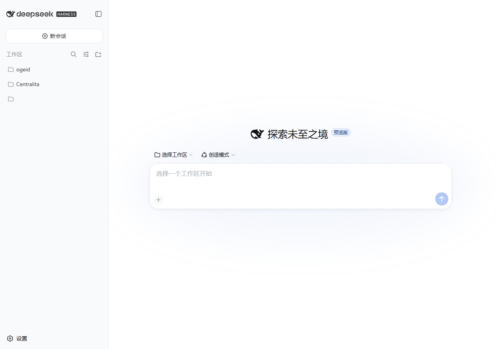

# ⏱️ dsh-deepseek-price-timer

[](./LICENSE)
[](https://github.com/dacs2019/dsh-deepseek-price-timer)
[](https://github.com/dacs2019/dsh-deepseek-price-timer)
[](https://github.com/dacs2019/dsh-deepseek-price-timer/actions)
[](https://github.com/dacs2019/dsh-deepseek-price-timer)

A live widget for the **DeepSeek Harness Web GUI** that shows the current
**DeepSeek peak / off-peak pricing** (deepseek-v4-flash and deepseek-v4-pro).

It **detects your PC's timezone automatically** and always shows the
**contrast between your local time and UTC**, so you instantly know whether
you are in PEAK (2× rate) or OFF-PEAK (half price).



> **Read in Spanish — [README.es.md](./README.es.md)**

---

## ✨ Features

| | |
|---|---|
| 🌐 | **Live official prices** — fetches the price table from [api-docs.deepseek.com/quick_start/pricing](https://api-docs.deepseek.com/quick_start/pricing/) every 30 min (embedded fallback when offline) |
| 🕐 | **PC local clock** with its detected UTC offset (`12:34 PM (UTC-5)`) |
| 🌍 | **UTC clock** always visible next to it (`17:34 UTC`) |
| 🔴🟢🟡 | **PEAK / OFF-PEAK / FLAT pill** with a pulsing dot — FLAT counts down to the pricing cutover |
| 📊 | **24h timeline** in your local time: off-peak in green, peak blocks in red, with start/end times and a "now" marker |
| 💰 | **Price table** with **all models** from the official page (off-peak and peak) |
| 🧮 | **Live session cost estimate** (off-peak and peak) from real token usage |
| 🔔 | **Alert** when the window flips: "PEAK started!" / "VALLEY — half price" |
| 📌 | **Session header pill** — always visible next to the Session log button |
| 🗜️ | **Collapse** to a minimal pill (mobile friendly) |
| 🖱️ | **Tooltips** with details on the timeline |
| 🌍 | **i18n ES/EN** automatic from the browser language |
| ⚙️ | **Works in any timezone**: peak windows converted from UTC to your local time (midnight crossing and DST supported) |
| 🔄 | **Self-update** — the widget downloads, validates and applies new versions from the repo, then restarts |

### Official peak windows (defined in UTC)

- **01:00 – 04:00 UTC**
- **06:00 – 10:00 UTC**
- Everything else is **OFF-PEAK** (half the peak rate)
- New pricing effective **2026-08-16 16:00 UTC** (shown in your local time)

### Prices per 1M tokens (USD)

| Model | Cache hit (off-peak/peak) | Cache miss (off-peak/peak) | Output (off-peak/peak) |
|---|---|---|---|
| deepseek-v4-flash | $0.007 / $0.014 | $0.22 / $0.44 | $0.66 / $1.32 |
| deepseek-v4-pro | $0.022 / $0.044 | $0.66 / $1.32 | $1.98 / $3.96 |

---

## 📦 Installation

> Requires: [DeepSeek Harness](https://github.com/deepseek-ai/deepseek-harness) (`dsh web`).

### Option A — automatic (Windows, Linux and macOS)

```bash
# from the project root — the installer detects the OS
npm run install:profile
```

Or per system:

```bash
npm run install:profile:win     # Windows (uses scripts/install.ps1)
npm run install:profile:unix    # Linux/macOS (uses scripts/install.sh)
```

### Option B — manual

1. **Link/copy the package** into the flat profile fallback (resolvable from every profile):

   ```powershell
   # Windows (junction — edit once, works at runtime)
   cmd /c mklink /J "$env:USERPROFILE\.dsh\profiles\node_modules\dsh-deepseek-price-timer" "C:\path\to\dsh-deepseek-price-timer"
   ```

   ```bash
   # Linux/macOS
   ln -s /path/to/dsh-deepseek-price-timer "$HOME/.dsh/profiles/node_modules/dsh-deepseek-price-timer"
   ```

2. **Register the row** in the *home-level* patch (applies to **all profiles**: web, headless, custom):

   ```yaml
   # $HOME/.dsh/cordis.patch.yml
   - insert:
       - id: dspt-permanent
         name: 'dsh-deepseek-price-timer'
   ```

   > You can also put the row in a specific profile's patch (`~/.dsh/profiles/<profile>/cordis.patch.yml`).

3. **Restart the web server** (`dsh web`) and reload the page. The widget appears above the composer (`conversation.input.dock`) and a compact pill in the session header.

### Uninstall

```powershell
schtasks /delete /tn "DSH Web Restart" /f   # if you used the auto-restart task
# remove the patch row and delete the junction/copy of the package
```

---

## ⚙️ Configuration (environment variables)

| Variable | Description | Example |
|---|---|---|
| `DSH_DSPT_REPO` | Your GitHub repo (`owner/repo`). Enables the **update checker**: the widget shows "⬆ update vX.Y.Z available" when you publish a new version (`version.json` on `main`). | `DSH_DSPT_REPO=dacs2019/dsh-deepseek-price-timer` |
| `DSH_DSPT_PEAK_WINDOWS` | Overrides the peak windows (minutes of the UTC day, `start-end,start-end`). If DeepSeek changes the hours, change it here **without touching code**. | `DSH_DSPT_PEAK_WINDOWS=60-240,360-600` |

> Restart the web server (`dsh web`) after changing these variables.

## 🔄 How prices and the plugin update

- **Prices**: fetched automatically from the official page every 30 min (+ ↻ button) — **zero updates needed** when DeepSeek changes rates.
- **Code/windows**: push the change to GitHub and installers do `git pull` (or re-copy) + restart. The widget tells them with the **update checker** when `DSH_DSPT_REPO` is set.

---

## 🗺️ Where the widget lives

- Slot: `conversation.input.dock` (row above the composer), id `deepseek-price-timer`
- Header pill: `conversation.session.header.utilities`, id `deepseek-price-timer-pill`
- Width: matches the composer (`--dsh-composer-card-max-width`)
- Theme: native harness tokens (`--dsw-alias-*`) — adapts to light/dark

## ⚙️ How it works

1. The **official peak windows are defined in UTC** (DeepSeek's billing rule) → PEAK/OFF-PEAK is always computed in UTC (correct for any user).
2. The **timeline and clocks convert to the PC's local time** via `Date.getTimezoneOffset()` (DST and minute offsets like UTC+5:30 supported).
3. A peak window crossing local midnight splits into two timeline segments.
4. Before the 2026-08-16 cutover, the widget shows a **FLAT phase** with a live countdown to the new pricing.

## ⚠️ Known limitations

- **Timeline labels on DST change day**: block positions are correct (day percentages), but hour labels can drift 1 h on the day DST changes.
- **Session cost**: uses the first model's prices (the harness snapshot does not expose the model in use).
- **Prices**: obtained by parsing the official DeepSeek page; if its structure changes, the widget falls back to embedded prices and labels them "embedded prices (offline)".
- **Self-update**: trusts HTTPS from the configured repo (`DSH_DSPT_REPO`) and restarts the harness; on Windows it needs the `DSH Web Restart` scheduled task (created by `install.ps1`), on Linux/macOS a process manager or manual restart.

## 📄 License

MIT — see [LICENSE](./LICENSE).

## Changelog

**v1.5.0** — session header pill, FLAT phase with cutover countdown, accessibility (role/aria/data-phase), phaseAt() logic with tests.
**v1.4.1** — cross-platform npm installer (auto-detects OS), single source of truth for `inject`.
**v1.4.0** — audit round: fixed CI, no double writeHead, NaN prices (not $0), CSRF on self-update, .bak rollback, zero-width peak segments, full i18n, timers in effects, version watermark.
**v1.3.x** — header-driven price parser, same-origin CORS, validated self-update, .tmp.js extension fix.
**v1.2.0** — cross-platform self-update, Unix installer, tests + CI, anti-BOM.
**v1.1.0** — internal self-update, live official prices, local/UTC time.
